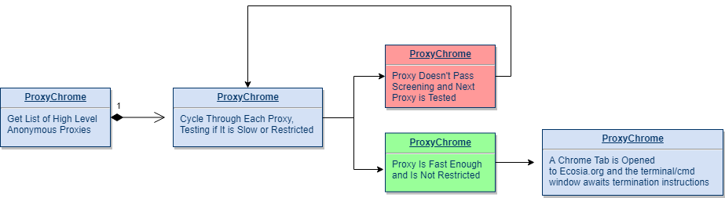

# ProxyChrome          
<a href="https://github.com/SeleniumHQ/selenium">
      
    </a>
    <a href="https://www.python.org/">
    	
    </a>
    <a href="https://pypi.org/project/beautifulsoup4/">
    	
    </a>

## General info
This simple program pulls a fresh list of 'elite' level anonymous proxies from [Proxy-List](https://www.proxy-list.download) via their API. Then it checks the list for a non-crowded proxy and opens anonymous :earth_americas:[Ecosia](https://www.ecosia.org/) search page in Chrome.

## 🚩 Table of contents
* [General info](#general-info)
  * [Sample](#sample)
  * [Flowchart](#flowchart)
  * [Technologies](#technologies)
  * [Prerequisites](#prerequisites)
* [Setup](#setup)
  * [Clone Repository](#clone-repository)
  * [Install ProxyChrome Dependencies](#install-proxychrome-dependencies)
  * [Overwrite ChromeDriver](#overwrite-chromedriver)
  * [Run ProxyChrome](#run-proxychrome)
* [Uses](#uses)
  * [ProxyPrinter](#ProxyPrinter)
* [Acknowledgments](#acknowledgments)
* [License](#license)

## Sample


## Flowchart


## Technologies
Project is created with:
* Python 3.7.3
* BeautifulSoup 4.0.0
* Selenium 3.14

## Prerequisites
* [Python 3.7.3](https://www.python.org/)
* [Google Chrome 75.0.37](https://www.google.com/chrome/)
* [Chrome Driver 74.0.37](https://sites.google.com/a/chromium.org/chromedriver/)

#### **Make sure to Download [Compatible](http://chromedriver.chromium.org/downloads/version-selection) Versions of Chrome Driver and Chrome**


## 💾 Setup
#### Clone Repository
Either download from a GUI or run the 'git clone' command on this url...
```
https://github.com/OliverMathias/ProxyChrome
```

#### Install ProxyChrome Dependencies
cd into the ProxyChrome folder and run this command to install all dependencies at once...
```
$ pip install -r dependencies.txt
```
#### Overwrite ChromeDriver
Make sure to copy your 'chromedriver' file into the ProxyChrome folder...


#### Run ProxyChrome
Finally, cd into the folder and run ProxyChrome...
```
$ python ProxyChrome.py
```
Browse anonymously WHILE planting trees!
:seedling: :evergreen_tree: :deciduous_tree:

## Uses
In addition to opening an anonymous chrome window, below are some alternate uses:

#### ProxyPrinter
Included in the code is a method that prints out a list of all the elite level anonymous proxies from [Proxy-List](https://www.proxy-list.download)'s API.
To use this functionality, simple comment out the main method and call the **getProxies()** method like so:

```
if __name__ == "__main__":
    #main()
    getProxies()
```

## Acknowledgments
* [Ecosia](https://www.ecosia.org/)
* [Proxy-List](https://www.proxy-list.download)

## 📜 License
This project is licensed under the MIT License - see the [LICENSE.md](LICENSE.md) file for details
